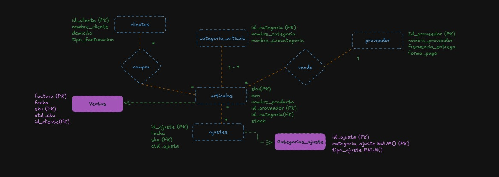
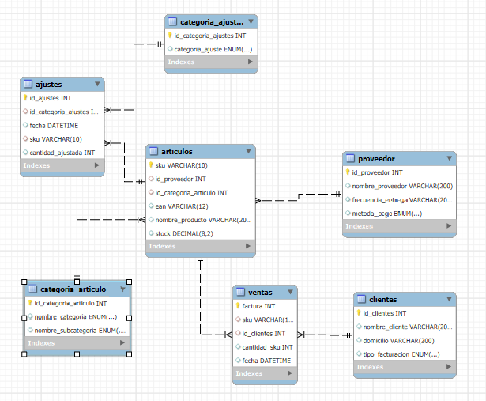

## Diseño Orignal de Base de datos DER ONTOLOGICO

DER WORKBENCH

## Base de Datos Supermercado

Con esta base de datos se busca mejorar el funcionamiento general de un supermercado. A traves de las difentes tablas creadas se busca optimizar las compras en base a un mejor analisis del stock y la ventas. También busco tener un mayor control de los productos que se merman-

## Esquema de la Base de Datos

# Tabla proveedor
Almacena información basica sobre los proveedores.

# Campos:
id_proveedor (INT, PK, AUTO_INCREMENT): Identificador único del proveedor.
nombre_proveedor (VARCHAR(200)): Nombre del proveedor.
frecuencia_entrega (VARCHAR(200)): Cuantos dias a la semana entrega el proveedor.
metodo_pago (ENUM): Forma de pago acordado con el proveedor, se utiliza ENUM ya que por lo general todos los proveedores utilizan tipos definidos,  Efectivo, 30 días, 60 días o 90 días.

# Tabla categoria_articulo
Se asignan diferentes categorias preestablecidas a fin de mejorar los analisis y evitar errores de tipeo al momento de cargar un articulo.

# Campos:
id_categoria_articulo (INT, PK, AUTO_INCREMENT): Identificador único de la categoría de artículo.
nombre_categoria (ENUM): divide los articulos en 3 grandes campos: Mercaderia General, Alimentos, Frescos
nombre_subcategoria (ENUM): se hace una division mas precisa segun el tipo de articulo

## Tabla articulos
Tabla "principal" de la Base de Datos la cual nos trae toda la informacion necesaria de los productos.

# Campos:
sku (VARCHAR(10), PK): se utiliza sku ya que se trata de un codigo internacional e irrepetible que se le asigna a cada productos que comercializan los diferentes proveedores.
id_proveedor (INT, FK): Referencia a proveedor.
id_categoria_articulo (INT, FK): Referencia a la categoria de cada articulo.
ean (VARCHAR(12)): código de barras del artículo.
nombre_producto (VARCHAR(200)): descripción del producto.
stock (DECIMAL(8,2)): cantidad de inventario disponible. Se utiliza decimal para preveer productos que se venden por peso

# Relaciones de la tabla:
FK a proveedor (id_proveedor).
FK a categoria_articulo (id_categoria_articulo).

## Tabla clientes
Datos de los clientes necesarios para la facturacion.

# Campos:
id_clientes (INT, PK, AUTO_INCREMENT): Identificador único del cliente.
nombre_cliente (VARCHAR(200)): Nombre del cliente.
domicilio (VARCHAR(200)): Domicilio del cliente.
tipo_facturacion (ENUM): Tipo de facturación segun registro del cliente en AFIP.

## Tabla categoria_ajustes
Define las causas de ajustes de inventario.

# Campos:
id_categoria_ajustes (INT, PK, AUTO_INCREMENT): Identificador único de la categoría de ajuste.
categoria_ajuste (ENUM): Tipo de ajuste.

## Tabla ajustes
Almacena los difernetes ajustes realizados en el inventario.

#Campos:

id_ajustes (INT, PK, AUTO_INCREMENT): Identificador único del ajuste.
id_categoria_ajustes (INT, FK): categoria del ajuste.
fecha (DATETIME): Fecha y hora en que se realiza el ajuste.
sku (VARCHAR(10), FK): Articulo que se ajusta
cantidad_ajustada (INT): Cantidad ajustada.

# Relaciones:
FK a articulos (sku).
FK a categoria_ajustes (id_categoria_ajustes).

## Tabla ventas
Registra las ventas realizadas.

# Campos
factura (INT, PK, AUTO_INCREMENT): Número de factura.
sku (VARCHAR(10), FK): articulo vendido.
id_clientes (INT, FK): cliente que realiza la compra.
cantidad_sku (INT): Cantidad de unidades vendidos
fecha (DATETIME): Fecha y hora de la venta.

# Relaciones:
FK a articulos (sku).
FK a clientes (id_clientes).

## Relaciones entre las Tablas

Proveedor - Artículos: Cada artículo (articulos) tiene un id_proveedor que apunta a la tabla proveedor.

Categoría de Artículo - Artículos: Cada artículo (articulos) tiene un id_categoria_articulo que apunta a categoria_articulo.

Clientes - Ventas: Cada venta (ventas) tiene un id_clientes que hace referencia a la tabla clientes.

Artículos - Ajustes: Cada ajuste (ajustes) tiene un sku que referencia a un artículo en articulos.

Categoría de Ajustes - Ajustes: Cada ajuste (ajustes) tiene un id_categoria_ajustes que apunta a categoria_ajustes.

Al momento de realizar la documentacion se detectaron algunos campos que podrian ser de utilidad (por ejemplo Fecha de Vencimiento en la Tabla Articulos) los cuales seran agregados en versiones posteriores y actualizaciones de la base de datos.
